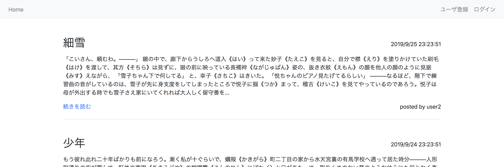
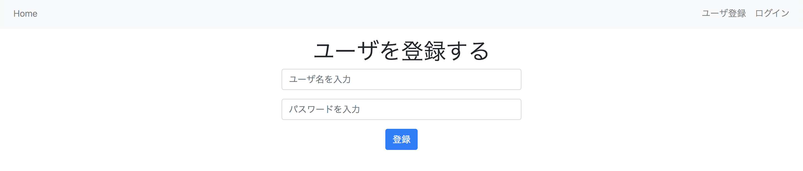
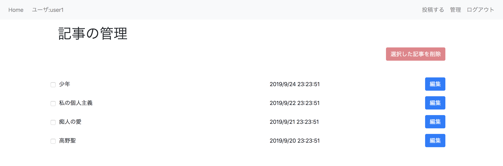
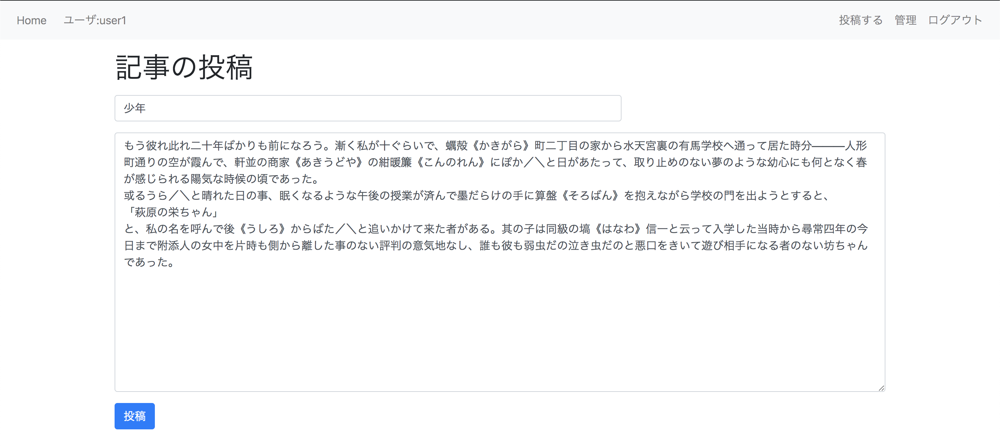
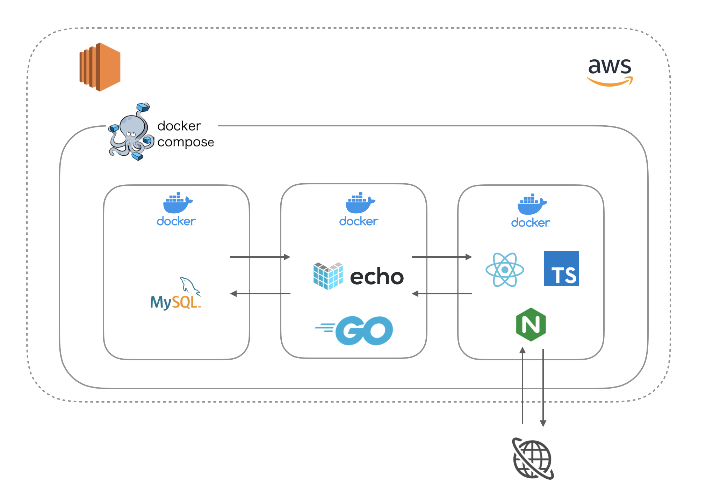
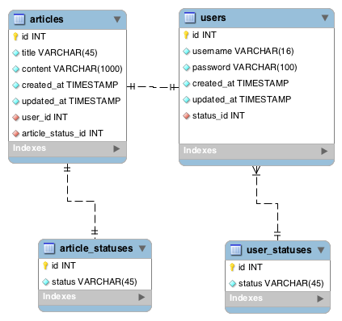

# portfolio-go-mysql-docker-webapp

simple webApp for my portfolio

- TypeScript, React, Go, MySQL, Docker Compose...

## Getting Started

- `$ docker-compose -f docker-compose.prod.yml up --build`

- access via port 80 (e.g <http://localhost/>)

## Functionality Overview

Home

Signup / Signin

Management Screen

Post / Edit

## System Overview

## System Design

ER diagram

Clean Architecture Oriented Design (only API Server)

referenced from [The Clean Architecture](https://blog.cleancoder.com/uncle-bob/2012/08/13/the-clean-architecture.html)